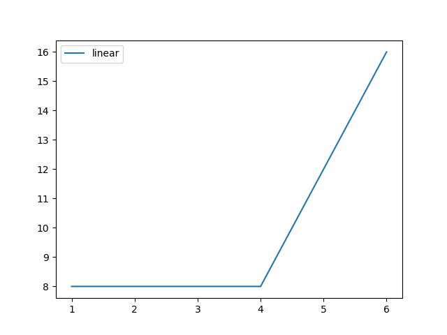
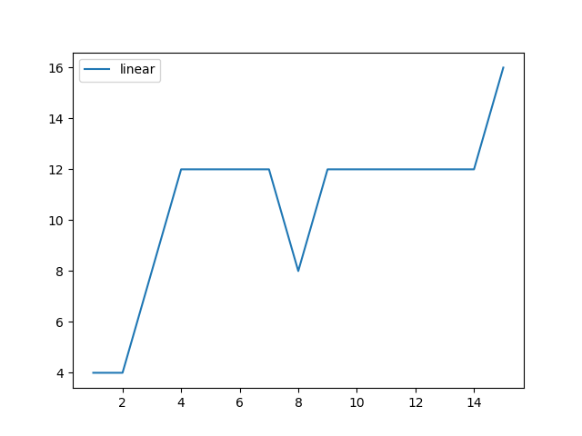
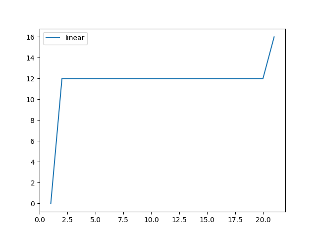
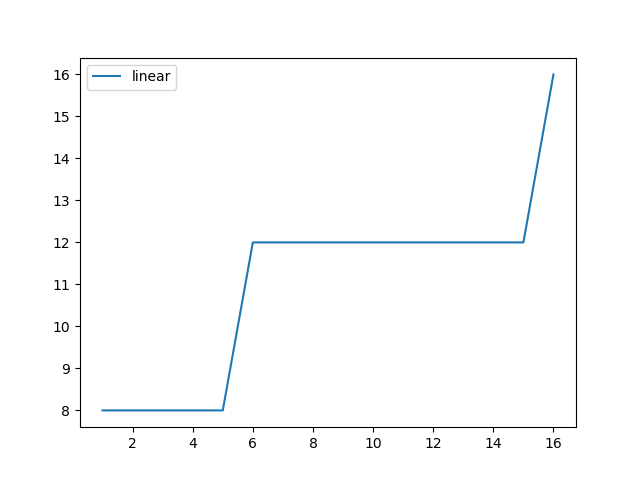
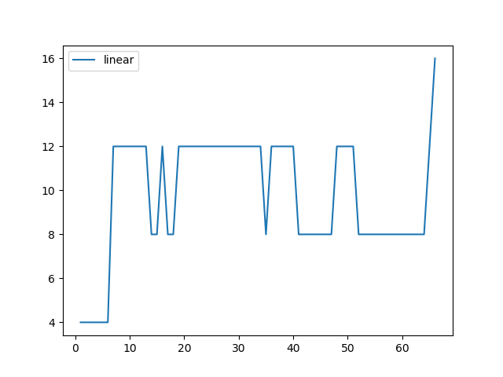

# Problema das 8 Rainhas
- Desenvolvido com Javascript e NodeJS

## Instalação
- Necessário NodeJS, Github e (Anaconda ou Python + matplotlib) instalados
- Execute git clone [link do projeto], nenhuma biblioteca necesária

## Startar
- Abra o terminal (se estiver usando o Anaconda, será necessário utilizar o terminal específico dele)
- Selecione a pasta do projeto
- Execute node app.js

## Análise

### Configurações
As configurações (padrão):

```
  algoritmo.maxEpoch = null; (Executa até encontrar)
  algoritmo.stopOnMax = true; (Para ao achar o valor máximo possível do fitness)
  algoritmo.slicePosition = 3; (Posição do array onde é feito o corte)
  algoritmo.populationThreshold = 300; (Máximo e população, se o crossover gerar mais população que isso é reduzida)
  algoritmo.maxFitness = 16; (Valor máximo do fitness)
```

Além dessas configurações:

```
  População inicial: 10
  Porcentagem de mutação: 3%
  Quantos dos melhores são salvos por época: 5
  Número de cromossomos removidos ao chegar no threshold de população: 80%
  Número de cromossomos em cada crossover: 80%
```

### Gráficos







### Análise

Após rodar o algoritmo algumas vezes, percebeu-se que a tendência é que, ao chegar no fitness 12 fique estabilizado por mais tempo que os outros valores.
Enquanto no desenvolvimento e testes de gráfico, muitas vezes a quantidade de épocas necessárias para encontrar o resultado foi menor do que 10 (mais de 30 execuções).
Raramente ocorreu queda no fitness (o gráfico 2 é um exemplo) diante todo o processo de desenvolvimento e de testes.

Ao alterar o ponto de corte de 3 para 4, ocorreu um aumento significativo na quantidade de épocas, chegando a um "extremo" que pode ser visto no gráfico 5.

Quando na geração de cromossomos, quando já existem indivíduos com fitness 12 dificilmente o fitness decai nas épocas seguintes (mas ainda ocorre). E quando ocorre, cai muito o fitness máximo da época mas na seguinte (na maioria dos casos) já retorna ao 12.
